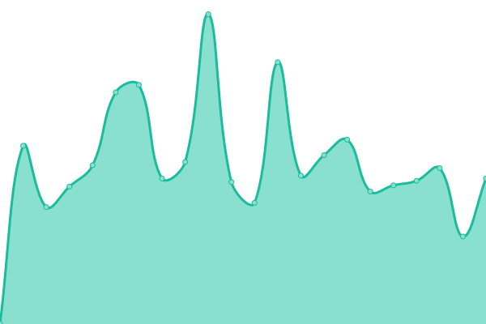
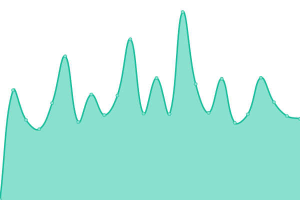
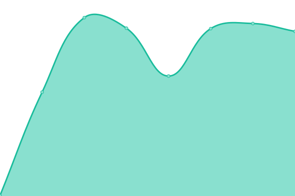

# [📈 Live Status](https://roava.github.io/rova-uptime-checks/): <!--live status--> **🟧 Partial outage**

This repository contains the open-source uptime monitor and status page for [ROVA](https://roava.github.io/rova-uptime-checks/).

<!--start: status pages-->
<!-- This summary is generated by Upptime (https://github.com/upptime/upptime) -->
<!-- Do not edit this manually, your changes will be overwritten -->
<!-- prettier-ignore -->
| URL | Status | History | Response Time | Uptime |
| --- | ------ | ------- | ------------- | ------ |
|  [Rova Dashboard](https://dashboard.dev.getrova.io) | 🟩 Up | [rova-dashboard.yml](https://github.com/roava/rova-uptime-checks/commits/HEAD/history/rova-dashboard.yml) | 

 976ms
     
 | 

<a href="https://roava.github.io/rova-uptime-checks/history/rova-dashboard">45.70%</a>
    

|  [Rova Website](https://dev.getrova.com) | 🟩 Up | [rova-website.yml](https://github.com/roava/rova-uptime-checks/commits/HEAD/history/rova-website.yml) | 

 375ms
     
 | 

<a href="https://roava.github.io/rova-uptime-checks/history/rova-website">45.86%</a>
    

|  [Rova ArgoCD DEV](https://argocd.dev.getrova.io) | 🟥 Down | [rova-argo-cd-dev.yml](https://github.com/roava/rova-uptime-checks/commits/HEAD/history/rova-argo-cd-dev.yml) | 

 381ms
     
 | 

<a href="https://roava.github.io/rova-uptime-checks/history/rova-argo-cd-dev">0.00%</a>
    

<!--end: status pages-->

[**Visit our status website →**](https://roava.github.io/rova-uptime-checks)
